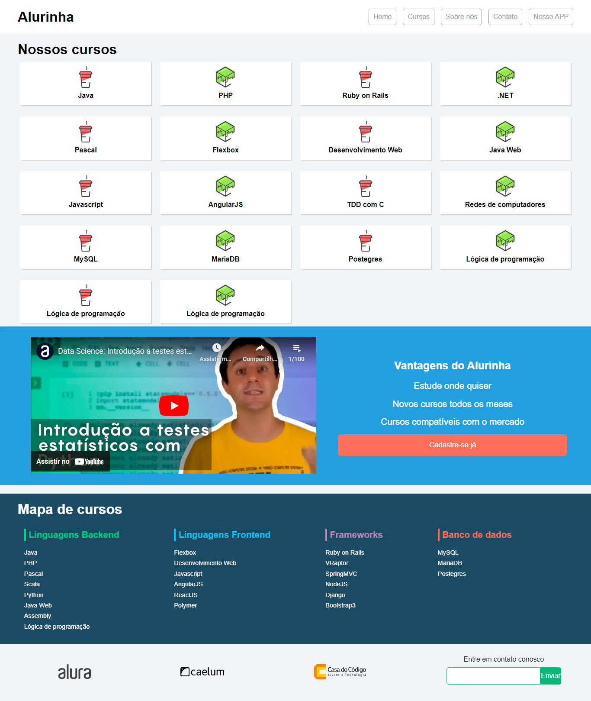

<h1 align="center">ALURINHA</h1>

<h3 align="center">Projeto de uma plataforma de cursos desenvolvido no curso de Flexbox da Alura.</h3>

 

  

##  Tópicos
- [📷 Imagem do projeto](#📷-imagem-do-projeto)

- [💻 Descrição do projeto](#💻-descrição-do-projeto)

- [🔨 Status do projeto](#🔨-status-do-projeto)

- [👉 Acesso ao projeto](#👉-acesso-ao-projeto)

- [🔥 Tecnologias utilizadas](#🔥-tecnologias-utilizadas)

- [💾 Licença](#💾-licença)

 

## 📷 Imagem do projeto

  

---

## 💻 Descrição do projeto

O projeto é uma plataforma de cursos e videoaulas online da área de tecnologia, possui diversos cursos envolvendo os campos de Front-End, Back-End, Frameworks e Banco de dados.

Da parte do <strong>Front-End</strong> a plataforma conta com cursos como "Desenvolvimento Web", "Flexbox", "Javascript", entre outros. Na parte de <strong>Back-End</strong> o site conta com cursos de "PHP", "Python", "Java", entre outros.

No campo de <strong>Frameworks</strong> a plataforma conta com cursos de "Django", "Bootstrap3", "NodeJS", entre outros. Já na parte de <strong>Banco de Dados</strong> o site possui cursos de "MySQL", "MariaDB" e "Postegres".

---
 

## 🔨 Status do projeto

<h4 style="text-transform: uppercase; color: #0F0">✔️ Projeto finalizado</h4>

---
 

## 👉 Acesso ao projeto

O projeto pode ser acessado [aqui](https://fel1324.github.io/Alurinha/)

---
 

## 🔥 Tecnologias usadas

* HTML e CSS
* Git e Github

---
 

## 💾 Licença

Esse projeto está sob a licença MIT.
